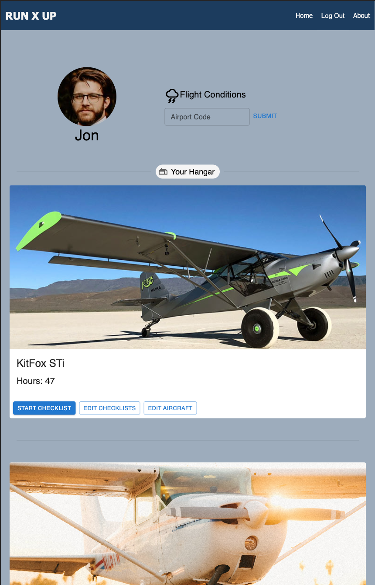
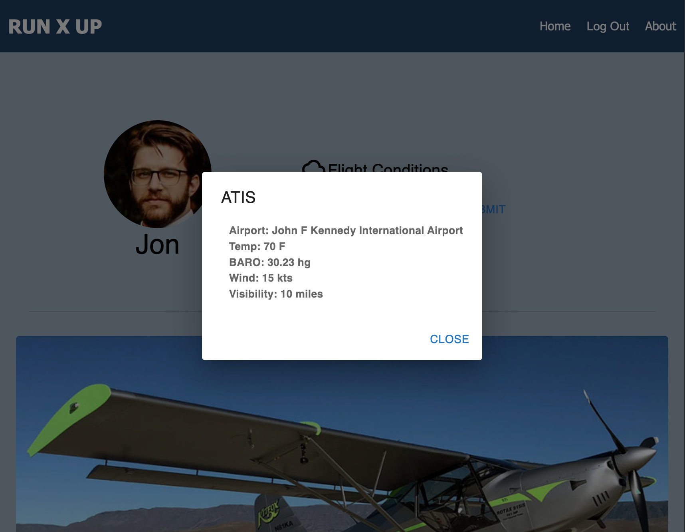
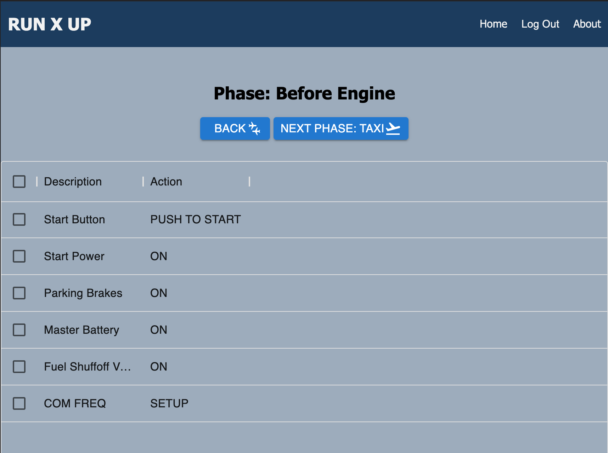
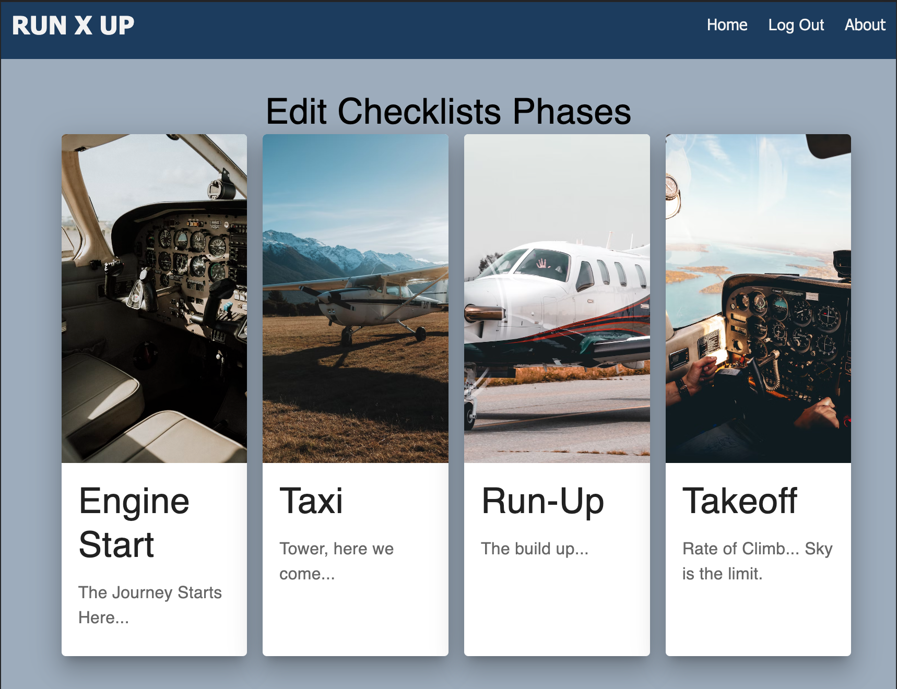

        
# Run-Up

## Table of Contents

- [Description](#description)
- [Screenshots](#screenshots)
- [Built With](#built-with)
- [Getting Started](#getting-started)
  - [Prerequisites](#prerequisites)
  - [Installation](#installation)
- [Usage](#usage)
- [License](#license)
- [Acknowledgements](#acknowledgements)
- [Contacts](#contacts)

## Description

Run-up is an application in which pilots, both student and veteran, can use to study and apply pre-flight safety checklist items. This mobile app is aimed at keeping all of the pre-flight checklist items in one place for use and review at any point during or before a flight.

## Screenshots

## Pilot Profile Page


## Weather API Interface


## Checklist


## Edit Checklist Page



### Prerequisites

- Node.js
- Express
- Postico
- Postgres
- Axios
- React
- Passport
- Redux
- API from checkwxapi.com
- Material UI

### Installation

- 1. Create a database in Postico called "run_up".

- 2. Run the SQL code in the databse.sql file. 
      - Start Postgres if not already started.

- 3. Open code editor of choice and run 'npm install' to install node modules.

- 4. Next, run 'npm run server'

- 5. Run 'npm run client' to build on local host which will populate in the browser of your choice.

- 6. Create an .env file

- 7. Create a `.env` file at the root of the project and paste this line into the file:
  ```
  SERVER_SESSION_SECRET=superDuperSecret
  ```
  While you're in your new `.env` file, take the time to replace `superDuperSecret` with some long random string like `25POUbVtx6RKVNWszd9ERB9Bb6` to keep your application secure. Here's a site that can help you: [https://passwordsgenerator.net/](https://passwordsgenerators.net/). If you don't do this step, create a secret with less than eight characters, or leave it as `superDuperSecret`, you will get a warning.

- 8. Set WEATHER_API_KEY within your `.env` to your personal api key from checkwxapi.com

- 9. Install the latest Material UI packages at https://mui.com/material-ui/getting-started/installation/


## Usage

- 1. Start by creating an account with the register navigation using a Username and secure password. 

- 2. Login in with your new credentials.

- 3. This will bring you to a pilot profile landing page. 

- 4. Here you will be able to add a plane with a template checklist that you will be able to customize later.

- 5. Now you will see the aircraft you added in the "Your Hangar" section of the profile page. 

- 6. Here you can edit both the checklist itself and the aircraft details by pressing the respective buttons on the aircraft card.

- 7. Once ready to proceed with the checklist itself tap the Start Checklist button.

- 8. This is where you as a pilot will go through each checklist item as you practice and apply it in the cockpit.

- 9. Complete each stage of the checklist by navigating with the Next button. 

- 10. To access the weather conditions API on the Pilot Profile Page, enter any four character ICAO code. i.e. (KJFK) and hit submit. 

## Acknowledgements

Thank you to the Prime Academy staff who helped make this application a reality. 

## Contacts

<a href="https://www.linkedin.com/in/Jonathon-Baxendell"></a>  <a href="mailto:j.bax626@live.com"></a>